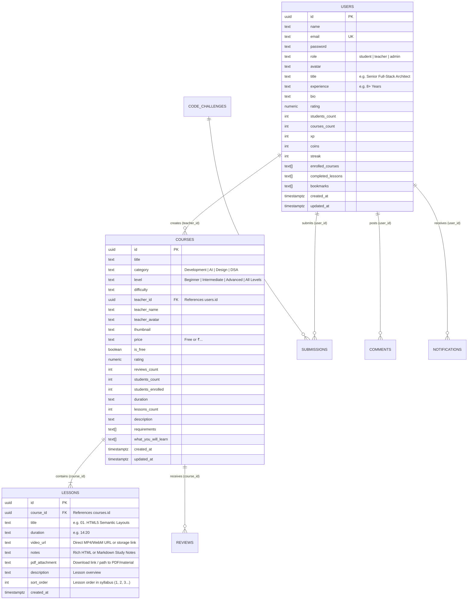

# ⚙️ RASH EduHub — Backend & Database Architecture Guide

This document provides a comprehensive, step-by-step technical breakdown of the **RASH EduHub Backend & Database Architecture**, detailing the role of every Node.js module, Express middleware, API route handler, Supabase database client, PostgreSQL schema table, and data mapper.

Use this guide to understand **how the backend operates**, **how database relationships function**, and **what happens when you modify any specific backend or database file**.

---

## 🏗️ 1. Overall Backend & Database Architecture

RASH EduHub backend follows a high-performance **Node.js + Express + Supabase Cloud PostgreSQL** architecture:

- **Express.js API Layer (`server/server.js`)**:
  - Serves RESTful API endpoints under `/api/*`.
  - Provides friendly clean route redirects for frontend navigation (`/instructors/:id/courses`, `/courses/:id`, `/courses/:id/notes`).
  - Applies security headers (CSP, nosniff, frame protection), rate limiting, body sanitization, CORS, and centralized error handling.
- **Supabase Cloud Database Layer (`server/supabaseClient.js`)**:
  - Direct connection to PostgreSQL hosted on Supabase Cloud using `@supabase/supabase-js`.
  - Utilizes `SUPABASE_SERVICE_ROLE_KEY` on the backend to manage database records safely without exposing credentials to the client.
- **Foreign Key Relational Architecture**:
  - Relational hierarchy: **Teacher (`users`) $\xrightarrow{1:N}$ Published Courses (`courses`) $\xrightarrow{1:N}$ Lessons & Study Notes (`lessons`)**.
  - Supabase PostgREST foreign-key joins (`.select('*, lessons(*)')`) return courses with embedded lesson syllabus and notes in a single query without N+1 performance penalties.
- **Database Data Mapper (`server/supabaseHelper.js`)**:
  - Automatically transforms PostgreSQL `snake_case` column names (`teacher_id`, `students_count`, `video_url`, `pdf_attachment`) into frontend-compatible JavaScript objects with normalized IDs (`id` and `_id`).
- **Authentication & Authorization (`server/middleware/auth.js`)**:
  - Issues and verifies standard JWT tokens (`Authorization: Bearer <token>`).
  - Verifies Google OAuth 2.0 ID tokens.
  - Enforces role-based access control (`student`, `teacher`, `admin`).
- **Python AI Microservices Proxy (`server/routes/ai-proxy.js`)**:
  - Forwards AI requests to Python microservices for adaptive learning, code AST evaluation, camera focus tracking, and career roadmap generation.

---

## 🗄️ 2. Supabase Cloud Database Schema & Relations

### Entity Relationship Diagram (ERD)



### Table Definitions in PostgreSQL

| Table Name | Primary Key | Foreign Keys | Key Columns & Notes |
| :--- | :--- | :--- | :--- |
| `users` | `id` (UUID) | None | Stores students, instructors, and admins. Contains profile data (`title`, `experience`, `bio`), role, credentials, and gamification metrics (`xp`, `coins`, `streak`). |
| `courses` | `id` (UUID) | `teacher_id` $\rightarrow$ `users(id)` | Stores course title, category, description, pricing, level, ratings, student counts, and instructor metadata. |
| `lessons` | `id` (UUID) | `course_id` $\rightarrow$ `courses(id)` | Stores individual lessons, video lecture URLs, sort order, and **full course study notes** (`notes`) with document attachments (`pdf_attachment`). |
| `comments` | `id` (UUID) | `user_id`, `course_id` | Lecture video discussions, likes array (`liked_by`), and timestamps. |
| `notifications`| `id` (UUID) | `user_id` $\rightarrow$ `users(id)` | System alerts, achievement badges, and assignment feedback. |
| `code_challenges`| `id` (UUID) | None | DSA questions with sample and hidden test cases, starter code signatures, and difficulty. |
| `submissions` | `id` (UUID) | `user_id`, `challenge_id` | User code submissions, verdicts (`Accepted`, `Wrong Answer`), and execution scores. |
| `reviews` | `id` (UUID) | `course_id`, `user_id` | Course star ratings (1-5) and written student reviews. |
| `activity_logs`| `id` (UUID) | `user_id` | Audit trails of user actions, login timestamps, and IP addresses. |
| `contact_messages`| `id` (UUID) | None | Inquiries submitted via Contact Us form. |

---

## 📡 3. REST API Routes Reference

### 👨‍🏫 Instructors Routes (`server/routes/instructors.js`)

Mounted at `/api/instructors`:

| Method | Endpoint | Access | Description |
| :--- | :--- | :--- | :--- |
| `GET` | `/api/instructors` | Public | Returns active instructors with $\ge 1$ published course. Calculates real course count, total student enrollment, and average instructor rating from the database. |
| `GET` | `/api/instructors/:id` | Public | Retrieves instructor profile details and full list of published courses. |
| `GET` | `/api/instructors/:id/courses` | Public | Retrieves all published courses for a specific instructor with joined lessons. |

### 📚 Course & Study Notes Routes (`server/routes/courses.js`)

Mounted at `/api/courses`:

| Method | Endpoint | Access | Description |
| :--- | :--- | :--- | :--- |
| `GET` | `/api/courses` | Public | Lists all published courses. Supports search query (`query`), category filtering (`category`), price filter (`Free`/`Paid`), teacher filter (`teacherId`), and sorting (`popular`, `rating`, `newest`). |
| `GET` | `/api/courses/:id` | Public | Retrieves a single course by UUID with embedded `lessons(*)` joined via Supabase PostgREST. |
| `GET` | `/api/courses/:id/notes` | Public | **Study Notes Endpoint**: Retrieves course notes and syllabus lessons ordered by `sort_order`. Returns note titles, duration, HTML/Markdown notes, and PDF download attachments. |
| `GET` | `/api/courses/teacher/:teacherId` | Public | Lists published courses owned by a specific instructor UUID. |
| `POST` | `/api/courses` | Teacher / Admin | Creates a new course and inserts initial lessons into the `lessons` table. Increments instructor's `courses_count` in `users`. |
| `PUT` | `/api/courses/:id` | Teacher (Owner) / Admin | Updates course metadata and synchronizes updated lessons/notes in the `lessons` table. |
| `DELETE` | `/api/courses/:id` | Teacher (Owner) / Admin | Deletes a course, cascades child lessons, and decrements teacher's `courses_count`. |
| `POST` | `/api/courses/:id/enroll` | Student | Enrolls student into course and increments `students_count` in `courses`. |
| `POST` | `/api/courses/lessons/:lessonId/complete` | Student | Toggles lesson completion state in student's `completed_lessons` array. |

### 🔐 Authentication Routes (`server/routes/auth.js`)

Mounted at `/api/auth`:

| Method | Endpoint | Access | Description |
| :--- | :--- | :--- | :--- |
| `POST` | `/api/auth/google` | Public | Authenticates Google OAuth ID token, creates user if new, and returns JWT token. |
| `POST` | `/api/auth/login` | Public | Email and password login for students and instructors. |
| `POST` | `/api/auth/dev-login` | Public | Quick developer & testing authentication by role (`student`, `teacher`). |
| `GET` | `/api/auth/me` | Authenticated | Retrieves current authenticated session user profile. |
| `PUT` | `/api/auth/change-password`| Authenticated | Secure password update with current password validation. |
| `DELETE` | `/api/auth/delete-account` | Authenticated | Self-deletion of user account. |

### 🧭 Clean Frontend Navigation Redirects (`server/server.js`)

Express routes configured to provide direct URL navigation and bookmarkable links:
- `GET /instructors/:instructorId/courses` $\rightarrow$ Redirects to `/teacher_profile.html?teacherId=:instructorId`
- `GET /courses/:courseId` $\rightarrow$ Redirects to `/playlist.html?courseId=:courseId`
- `GET /courses/:courseId/notes` $\rightarrow$ Redirects to `/student/notes.html?courseId=:courseId`

---

## 🗺️ 4. File Impact & Dependency Map ("If I Change X, What Happens?")

### ⚙️ Server Core & Configuration

| File Path | Role & Function | What Happens If Modified? |
| :--- | :--- | :--- |
| [`server/server.js`](file:///c:/Users/rishi/OneDrive/Desktop/RASH%20EduHub%201/RASH%20EduHub%201/server/server.js) | Express entry point. Mounts all API routers, rate limiters, static file servers, health checks, and friendly URL redirects. | **Core Routing Impact**: Changes server port, global middleware, static paths, or route mounts across the entire system. |
| [`server/supabaseClient.js`](file:///c:/Users/rishi/OneDrive/Desktop/RASH%20EduHub%201/RASH%20EduHub%201/server/supabaseClient.js) | Initializes Supabase SDK client with `SUPABASE_URL` and `SUPABASE_SERVICE_ROLE_KEY`. | **Database Connection Impact**: Affects connection to Supabase PostgreSQL across all backend routes. |
| [`server/supabaseHelper.js`](file:///c:/Users/rishi/OneDrive/Desktop/RASH%20EduHub%201/RASH%20EduHub%201/server/supabaseHelper.js) | Data formatters (`formatUser`, `formatCourse`, `formatLesson`, `formatComment`). Maps Postgres columns to camelCase objects. | **Data Format Impact**: Changes JSON shapes returned to the frontend. Modify this whenever schema columns are added or changed. |
| [`server/seed.js`](file:///c:/Users/rishi/OneDrive/Desktop/RASH%20EduHub%201/RASH%20EduHub%201/server/seed.js) | Database population script. Seeds verified instructors, courses, lessons, and rich study notes into Supabase. | **Seed Data Impact**: Changes initial database state when running `node server/seed.js`. |
| [`server/.env`](file:///c:/Users/rishi/OneDrive/Desktop/RASH%20EduHub%201/RASH%20EduHub%201/server/.env) | Stores secrets (`PORT`, `JWT_SECRET`, `SUPABASE_URL`, `SUPABASE_SERVICE_ROLE_KEY`, `GOOGLE_CLIENT_ID`). | **Security & Config Impact**: Changes connection strings, token secrets, or OAuth credentials. |

### 🛡️ Middleware Modules (`server/middleware/`)

| File Path | Role & Function | What Happens If Modified? |
| :--- | :--- | :--- |
| [`server/middleware/auth.js`](file:///c:/Users/rishi/OneDrive/Desktop/RASH%20EduHub%201/RASH%20EduHub%201/server/middleware/auth.js) | `protect` (verifies Bearer JWT & attaches `req.user`), `authorize(...roles)` (enforces student/teacher permissions). | **Auth Security Impact**: Changes session verification, token validation, or access rules. |
| [`server/middleware/errorHandler.js`](file:///c:/Users/rishi/OneDrive/Desktop/RASH%20EduHub%201/RASH%20EduHub%201/server/middleware/errorHandler.js) | Central error catch block returning JSON `{ success: false, message }`. | **Error Formatting Impact**: Changes how backend crashes or validation errors are presented. |
| [`server/middleware/rateLimiter.js`](file:///c:/Users/rishi/OneDrive/Desktop/RASH%20EduHub%201/RASH%20EduHub%201/server/middleware/rateLimiter.js) | Rate limiting on `/api` (100 reqs/15m) and auth endpoints (15 reqs/15m). | **Throttling Impact**: Adjusts anti-abuse request limits. |
| [`server/middleware/validator.js`](file:///c:/Users/rishi/OneDrive/Desktop/RASH%20EduHub%201/RASH%20EduHub%201/server/middleware/validator.js) | Input sanitization against XSS and parameter pollution. | **Data Sanitization Impact**: Modifies input cleaning rules. |

---

## 💻 5. Frontend Service Layer Integration

The frontend connects to the backend through modular services in `js/services/`:

```
Frontend Pages (studentDashboard.js, playlistPage.js, notesPage.js)
       │
       ▼
Service Layer (courseService.js, userService.js, authService.js)
       │
       ▼
Central Fetch Helper (EduHubDB.api in db.js) [Injects JWT Bearer Token]
       │
       ▼
Node.js / Express REST API (server/routes/*)
       │
       ▼
Supabase Client (server/supabaseClient.js)
       │
       ▼
Supabase Cloud PostgreSQL Database (users, courses, lessons)
```

### Key Service Methods

1. **`UserService` (`js/services/userService.js`)**:
   - `UserService.getInstructors()` $\rightarrow$ calls `GET /api/instructors` (returns active teachers with published courses).
   - `UserService.getInstructor(id)` $\rightarrow$ calls `GET /api/instructors/:id`.
   - `UserService.getInstructorCourses(id)` $\rightarrow$ calls `GET /api/instructors/:id/courses`.
   - `UserService.getStudentStats()` $\rightarrow$ calls `GET /api/users/student/stats`.
   - `UserService.getTeacherStats()` $\rightarrow$ calls `GET /api/users/teacher/stats`.

2. **`CourseService` (`js/services/courseService.js`)**:
   - `CourseService.getAllCourses()` $\rightarrow$ calls `GET /api/courses`.
   - `CourseService.getCourseById(courseId)` $\rightarrow$ calls `GET /api/courses/:id` (returns course with embedded lessons).
   - `CourseService.getCourseNotes(courseId)` $\rightarrow$ calls `GET /api/courses/:id/notes` (returns lessons, rich notes, and attachments).
   - `CourseService.searchCourses({ query, category, level, price, sortBy })` $\rightarrow$ calls `GET /api/courses?...`.
   - `CourseService.createCourse(courseData)` $\rightarrow$ calls `POST /api/courses`.
   - `CourseService.updateCourse(courseId, fields)` $\rightarrow$ calls `PUT /api/courses/:id`.
   - `CourseService.enrollStudent(courseId)` $\rightarrow$ calls `POST /api/courses/:id/enroll`.

---

## 💡 6. Practical Backend Editing Scenarios

### Scenario 1: Adding a New Field to Course Notes (e.g., `estimated_reading_minutes`)

1. **Update Database Schema**:
   Run SQL in the Supabase SQL Editor:
   ```sql
   ALTER TABLE lessons ADD COLUMN estimated_reading_minutes INT DEFAULT 10;
   ```
2. **Update Data Mapper (`server/supabaseHelper.js`)**:
   In `formatLesson(l)`:
   ```javascript
   estimatedReadingMinutes: l.estimated_reading_minutes || 10,
   ```
3. **Expose in Course Notes Endpoint (`server/routes/courses.js`)**:
   In `GET /api/courses/:id/notes`:
   ```javascript
   readingMinutes: l.estimated_reading_minutes || 10,
   ```
4. **Display in Frontend (`js/pages/notesPage.js`)**:
   Read `note.readingMinutes` and render `<span class="badge"><i class="fas fa-clock"></i> ${note.readingMinutes} min read</span>`.

---

### Scenario 2: Adding a New Database Query with Foreign Key Embedding

When querying parent-child entities in Supabase:
```javascript
// Example: Get course with its lessons and teacher profile in ONE query:
const { data, error } = await supabase
   .from('courses')
   .select(`
      id,
      title,
      category,
      lessons (
         id,
         title,
         duration,
         notes,
         pdf_attachment
      )
   `)
   .eq('id', courseId)
   .single();
```

---

### Scenario 3: Running Database Seeds or Refreshing Data

To populate or refresh instructors, courses, and structured lecture notes:
```bash
node server/seed.js
```
The script:
1. Verifies instructor accounts in `users` (Harsh Singh, Adarsh Sir, SV Sir).
2. Inserts production courses into `courses`.
3. Inserts lecture lessons and study notes into `lessons`.
4. Updates instructor `courses_count` in `users`.

---

### Scenario 4: Running Backend Locally

To launch the Express backend on `http://localhost:5000`:
```bash
node server/server.js
```
Health check verification:
```bash
curl http://localhost:5000/api/health
```

---

*Documentation maintained for RASH EduHub engineering and database architecture.*
